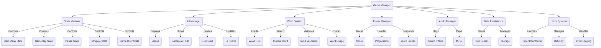

# Word_Hihi_tsohg

```mermaid
graph TD
    A(Game Manager)
    B(State Machine)
    C(UI Manager)
    D(Word System)
    E(Player Manager)
    F(Audio Manager)
    G(Data Persistence)
    H(Utility Systems)

    A --> B
    A --> C
    A --> D
    A --> E
    A --> F
    A --> G
    A --> H

    B -->|Controls| I(Main Menu State)
    B -->|Controls| J(Gameplay State)
    B -->|Controls| K(Pause State)
    B -->|Controls| L(Struggle State)
    B -->|Controls| M(Game Over State)

    C -->|Displays| N(Menus)
    C -->|Shows| O(Gameplay HUD)
    C -->|Handles| P(User Input)
    C -->|Updates| Q(UI Events)

    D -->|Loads| R(Word Lists)
    D -->|Selects| S(Current Word)
    D -->|Validates| T(Input Validation)
    D -->|Tracks| U(Word Usage)

    E -->|Tracks| V(Score)
    E -->|Handles| W(Progression)
    E -->|Responds| X(Word Entries)

    F -->|Plays| Y(Sound Effects)
    F -->|Plays| Z(Music)

    G -->|Saves| AA(High Scores)
    G -->|Manages| AB(Storage)

    H -->|Handles| AC(Timer/Countdown)
    H -->|Manages| AD(Difficulty)
    H -->|Handles| AE(Error Logging)
```
